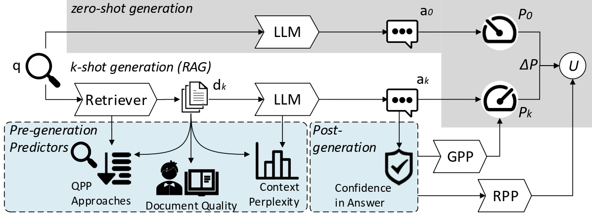

# Predicting Retrieval Utility and Answer Quality in RAG



💻 This repository contains the code for the ECIR 2026 paper **Predicting Retrieval Utility and Answer Quality in Retrieval-Augmented Generation**, by Fangzheng Tian, Debasis Ganguly, and Craig Macdonald.

📄 **Paper:** https://arxiv.org/abs/2601.14546 **and also** https://link.springer.com/chapter/10.1007/978-3-032-21289-4_24

## 🔍 Main findings

We study two prediction targets in RAG:

- **GPP:** answer quality of the RAG answer generated from a context composed of the top-`k` retrieved passages, `P_k`;
- **RPP:** retrieval utility, `P_k - P_0`.

The experiments show that these targets can be predicted from signals available around the RAG pipeline, but different signals capture different aspects of performance. In particular, combining complementary feature families is consistently stronger than relying on a single signal. Context-side perplexity is especially useful for non-factoid settings, while answer-side confidence is particularly informative for factoid answer quality.

## 🧩 Repository overview

The code has two layers.

### 1. Feature calculation

`compute_features.py` converts retrieval/generation inputs into a unified feature matrix using five feature families:

- `qpp/` — query performance prediction signals;
- `context_perplexity/` — context perplexity;
- `qualt5/` — QualT5 document quality;
- `posteriors/` — post-generation answer confidence;
- `readability/` — readability signals.

### 2. Final prediction pipeline

`analyse.py` combines the feature matrices with answer-quality evaluations, constructs the GPP/RPP targets, and produces the final single-feature and feature-combination correlation results.

## Environment

Create the tested environment with:

```bash
conda env create -f environment.yml -n rag_prediction
conda activate rag_prediction
```

### Machine requirements

For the included smoke tests, a CPU machine is sufficient.

For full reproduction:

- **Java 17** is required by PyTerrier;
- a **GPU is recommended** for the default 8B language model used for context perplexity;
- allow substantial local storage for retrieval artifacts: the public RagWiki dense E5 index is about 65 GB and the sparse Terrier index about 13 GB;
- additional space is needed for model checkpoints and local document-text data.

## Minimal usage

First verify the installation:

```bash
bash scripts/smoke_test.sh
bash scripts/smoke_pipeline.sh
```

Compute features for one retrieval condition:

```bash
python compute_features.py \
  --retrieval-csv data/retrieval/nq_test/e5.csv \
  --generation-json data/generations/nq_test/e5_k3.json \
  --doc-dict data/doc_dicts/nq_wiki_dict.pkl \
  --qpp-precomputed data/qpp/nq_test/e5_k3.csv \
  --dataset nq_test \
  --retriever e5 \
  --k 3
```

Then run the final analysis:

```bash
python analyse.py \
  --dev-features outputs/features/nq_dev_e5_k3/features.csv \
  --test-features outputs/features/nq_test_e5_k3/features.csv \
  --dev-zero-eval data/evaluations/nq_dev/zero_context.json \
  --dev-k-eval data/evaluations/nq_dev/e5_k3.json \
  --test-zero-eval data/evaluations/nq_test/zero_context.json \
  --test-k-eval data/evaluations/nq_test/e5_k3.json \
  --task nq \
  --retriever e5 \
  --k 3
```

Feature outputs are written under `outputs/features/`, and final correlation results under `outputs/correlations/`.

See `data/README.md` for the expected local input formats. The repository includes only a small historical smoke-test fixture, not the full experiment data.
